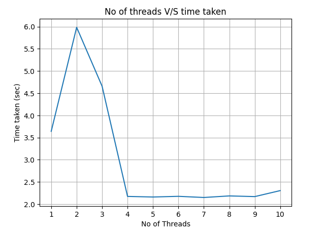
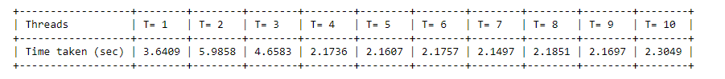

# MultiThreading_Task

### OBJECTIVE:
To perform multiplication of 100 matrices of size 1000 X 1000 with varying number of threads and generate visual data representations of time taken and cpu usage.

### METHODOLOGY:
1. **Matrix Multiplication:** multiply() function conducts matrix multiplication of matrices A and B using np.dot(). The answer is stored at a specific index of result array.

2. **Threads utilization:** Implement run_threads() to execute matrix multiplication using n (1-10) number of threads. Initialize a list threads to store thread objects. Iterate over the list of matrices, creating a new thread for each matrix multiplication operation using threading.Thread() constructor. Start each thread using the start() method. After creating all threads, wait for all threads to complete using the join() method. Return the time taken for the multiplication operations.

3. **Matrix Generation:** Generating a constant matrix A of size 1000x1000 using numpy.random.rand(). Creating a list of 100 random matrices of the same size.

4. **Execution:** Invoke run_threads() for each number of threads in the range from 1 to 10, recording the time taken for each operation. The results are stored in the results_table list along with the corresponding number of threads.

5. **Results:** Results are displayed in a tabular format using tabulate(). Number of threads are plotted against corresponding time taken using matplotlib.pyplot.plot().

### RESULTS:
#### Number of threads v/s Time Taken-

It is observed that the minimum time is taken when the the number of threads are 7.
